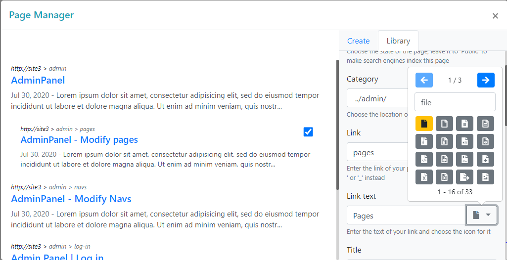

## Intro
A simple bootstrap, AJAX, PHP and Mysqli webpage CRUD app.



## Features
- `Create`, `Update`, `Delete` webpage `metadata` (`title`, `description`, `keywords`) and (link, link_text ...);
- Saves the data as a JSON string in a Mysqli table
- Automaticaly create a PHP file named as the `link`
- No refresh, using AJAX
- Can be display as a panel by the click of a button

## Installation
- clone the repo

```bash
$ git clone https://github.com/raherinjatovomahefasoa/rnct-pages.git
```

## Mysqli Database
- Create a Mysqli Table like this

```sql
CREATE TABLE `pages` (
  `id` int(11) NOT NULL,
  `page_id` varchar(70) NOT NULL,
  `data` text NOT NULL
) ENGINE=InnoDB DEFAULT CHARSET=latin1;
```

- Modify the `settings.json`

The server
```json
"mysqlConnect": {
    "server": "localhost",
    "database": "dbname",
    "username": "username",
    "password": "yourpassword"
}
```

The table name

```json
"tables": {
    "pages": "pages"
}
```

The page files folder

```json
"folders": {
    "pages": "files/pages"
},
```

## PHP ajax needed files
- `ajax.php`, `settings.json` files and the `src`, `vendor` folders should be placed in the root of your host with your `index.php`.

eg: localhost/**here..**

- write this in your `ajax.php`


```php
use RnctAdmin\Main\Database;
use RnctAdmin\Main\Ajax;
use RnctAdmin\Main\RnctPages;

// get main package
require_once realpath("vendor/autoload.php");

// connect to database
$settings = realpath("settings.json");
$db = new Database($settings);
$param = $db->get_params();

// call ajax
$ajax = new Ajax($param);
$ajax->process_data();
```

## Important HTML tag
- Add this in your index `head` tag to avoid some AJAX relative path problems

```html
<base href="/">
```

## Usage
- Link the CDN dependencies which are `jquery@1.9.1`, `popper.js@1.16.0`, `bootstrap@4.5.0`, `bootstrap-iconpicker-latest`.
- Link the `css` and `js` in the `rnct-dist` folder and then the `js` in `dist` folder

```html
<!-- link the other dependencies css here -->
<link rel="stylesheet" href="rnct-dist/css/rnct-admin-module.css">
<!-- link the other dependencies script here -->
<script src="rnct-dist/js/rnct-admin-module.js"></script>
<script src="dist/js/rnct-page-manager"></script>
```

- Create a `div`, add an `id` to it.

```html
<div id="wrapper"></div>
```
- And just write this js code

```js
var rnctPages = new RnctPages('#wrapper');
```

- `asPanel` setting

```html
<button type="button" id="button">Show</button>
<div id="wrapper"></div>
```
```js
var rnctPages = new RnctPages('#wrapper',{
    trigger: "#button",
    asPanel: true
});
```

## Settings
| Index    | Description     | Variable type
| :------------- | :------------- |:------------- |
| trigger     | Selector of the trigger button| Jquery selector |
| asPanel     | Display as a panel    | boolean |
| developerMode     | Show the ajax response in the browser console  | boolean |
| column_1     | defines the css class `col-x` of the 2 col of the app    | 2-11 |

## Database JSON string
- The JSON string is saved in the column `data`
- The JSON string structure is like this
```json
{
    "type":"public", // type of the page, can also be protected, and private
    "category":"page_5f9879hfeb2356", // id of the page selected in the input category
    "link":"your-page-link",
    "link_text":"Your link text",
    "icon":"fas fa-user-lock",
    "title":"You page title",
    "descri":"Your page description",
    "keywords":"some, key, words",
    "date":"1596141418",
    "id":"page_5f219bceb3370" // id of the page, generated automaticaly
}
```
